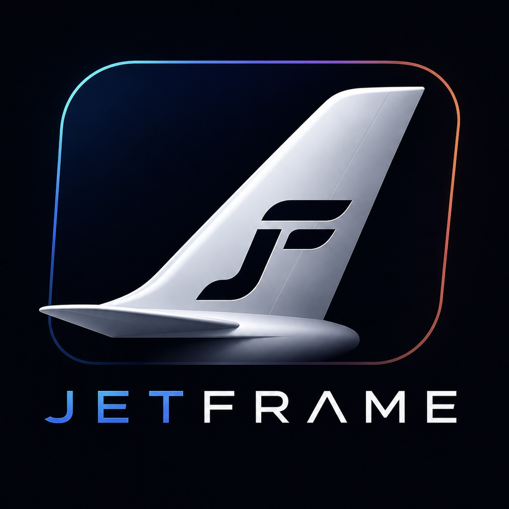

# ioBroker.jetframe

[](https://www.npmjs.com/package/iobroker.jetframe)
[](https://www.npmjs.com/package/iobroker.jetframe)


[](https://github.com/backfisch88/ioBroker.jetframe/actions/workflows/test-and-release.yml)

---

# ✈️ JetFrame

JetFrame is a modern Apple-style FlightWall adapter for ioBroker.

It detects nearby aircraft based on your window position and visualizes them with live flight information, airline branding, aircraft metadata and optional speech announcements.

Designed especially for:

- Kitchen FlightWalls
- Wall-mounted tablets
- iPads
- Smart mirrors
- Home dashboards
- Aviation enthusiasts

---

# ✨ Features

- Live aircraft detection
- Window-direction based filtering
- Apple-style glass UI
- Airline logos
- Manufacturer logos
- Flight routes
- Aircraft type detection
- Callsign / flight number
- Live ADS-B data
- JetPhotos integration
- Special liveries
- `specialLiveryVisText` support
- Browser speech synthesis
- Optional external speech output via ioBroker
- Speech mode:
  - `browser`
  - `external`
  - `both`
- Flyover animations
- Adaptive mobile UI
- Safari/iPhone optimized
- Night mode
- Airline pill UI
- Performance optimized rendering

---

# 🛠 Requirements

- ioBroker
- simple-api adapter
- modern browser (Safari or Chrome recommended)

---

# 📦 Installation

```bash
iobroker url https://github.com/backfisch88/ioBroker.jetframe/releases/latest/download/iobroker.jetframe-0.4.0.tgz --host this
```

---

# ⚠️ Legal Notice

JetFrame may display publicly available aviation-related information including:

- airline names
- aircraft metadata
- airport information
- aircraft images
- airline logos
- manufacturer logos
- live flight tracking data

All trademarks, logos, airline names, aircraft images and related content remain the property of their respective owners.

JetFrame is not affiliated with, endorsed by or officially connected to any airline, airport, aircraft manufacturer, JetPhotos, ADS-B provider or flight tracking service.

The adapter is intended exclusively for:

- private use
- informational purposes
- non-commercial local visualizations

JetFrame itself does not bundle or claim ownership of third-party trademarks, airline logos or aircraft photography unless explicitly stated otherwise.

Users are responsible for complying with the respective licenses, API terms and usage restrictions of configured external data sources.

If you are a rights holder and believe content is being used improperly, please open an issue in this repository.

---

# 📱 Optimized for

- iPad
- iPhone
- Safari
- Chrome
- ioBroker VIS
- Dashboard panels
- Smart mirrors
- Kitchen displays

---

# 🚀 Roadmap

Planned future features:

- multi-aircraft mode
- enhanced map overlays
- HomeKit integration
- additional speech providers
- local image caching improvements
- configurable themes
- advanced airport filtering

---

# Changelog

## **WORK IN PROGRESS**

### v0.4.0

- Initial public release
- Live aircraft detection
- Speech synthesis support
- Special liveries
- Airline logos
- Mobile optimized UI
- Flyover animations
- Apple-style glass interface

---

# License

MIT License

Copyright (c) 2026 backfisch88

Permission is hereby granted, free of charge, to any person obtaining a copy
of this software and associated documentation files (the "Software"), to deal
in the Software without restriction, including without limitation the rights
to use, copy, modify, merge, publish, distribute, sublicense, and/or sell
copies of the Software.

THE SOFTWARE IS PROVIDED "AS IS", WITHOUT WARRANTY OF ANY KIND.